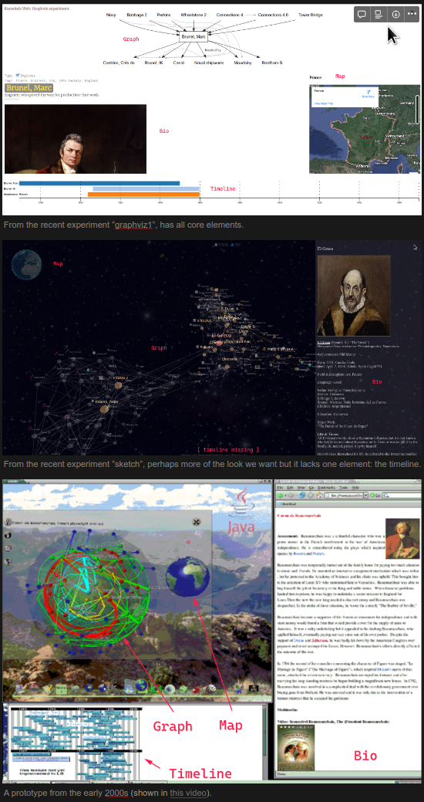

# K-Web
This is the code behind: https://k-web.ismandatory.com/ (both the User Interface and the underlying API)

Short term vision is being described [here](https://burkives.notion.site/K-Web-User-Interface-Minimal-Product-dc76722ef10b465c8d987e8f16bedc95?pvs=4).

Basically the plan is to build a better version of:  


## Limitations
Biographies are currently only accessable by team members.

## Contribute
See [ui/README](ui/README.md).  
Join the [Facebook group](https://www.facebook.com/profile.php?id=100057209809238) & the Discord.  
Questions? [karl@passionismandatory.com](mailto:karl@passionismandatory.com).  

## K-Web API (server)
For this you need (team) access to The Brain...

```sh
# start example
PORT=7575 BRAIN_DIR=../Brain/B02 node .
```